# Avidelta Architecture

This document provides a high-level overview of the Avidelta system architecture, showing how notes flow through the automation pipeline to the frontend dashboard.

---

## System Overview

Avidelta is a **full-stack automation platform** with three main layers:

1. **Automation Engine** (Python) - Ingests notes, generates summaries with AI, creates GitHub issues
2. **API Layer** (Next.js API Routes) - Exposes automation status, summaries, and metrics
3. **Frontend Dashboard** (Next.js App Router) - Displays live automation status, workflow history, and results

---

## Data Flow Diagram

```mermaid
graph TD
    A[📝 Daily Notes<br/>output/notes/] --> B[🐍 daily_v2.py<br/>Python Automation Engine]
    B --> C[🤖 OpenAI GPT-4 Turbo<br/>AI Summarization]
    C --> D[💾 JSON Output<br/>output/daily_summary.json]
    D --> E[📋 GitHub Issues<br/>Auto-created from action items]
    D --> F[📊 Audit Logs<br/>output/audit_*.json]
    
    G[⏰ GitHub Actions<br/>Daily 5 AM PT] --> B
    G --> H[📦 Workflow Artifacts<br/>Uploaded to Actions]
    
    I[🌐 Next.js API<br/>/api/automation-status] --> J[📊 GitHub Actions API<br/>Fetch workflow runs]
    J --> K[🖥️ Frontend Dashboard<br/>Live status + history]
    
    D --> I
    F --> I
    
    style B fill:#0ea5e9
    style C fill:#8b5cf6
    style I fill:#10b981
    style K fill:#f59e0b
```



---

## Component Details

### 1. Automation Engine (`scripts/daily_v2.py`)

**Purpose:** Core automation script that processes notes and generates structured outputs.

**Key Features:**
- Reads markdown/text files from `output/notes/`
- Uses OpenAI API to generate summaries, action items, and assessments
- Creates labeled GitHub issues via GitHub API
- Supports `--demo` and `--dry-run` modes for safe testing
- Outputs structured JSON to `output/daily_summary.json`
- Maintains audit trail in `output/audit_*.json`

**Configuration:**
- `.env.local` - Environment variables (API keys, repo settings)
- `scripts/requirements.txt` - Python dependencies

**GitHub Actions Trigger:**
- `.github/workflows/daily-run.yml` - Runs daily at 5 AM PT
- Manual trigger available from Actions tab

---

### 2. API Layer (Next.js API Routes)

**Purpose:** Provides endpoints for frontend to access automation data.

**Key Endpoints:**
- `/api/automation-status` - Fetches last 7 workflow runs from GitHub Actions API
- `/api/daily-summary` - Serves contents of `output/daily_summary.json`
- `/api/health` - Health check endpoint
- `/api/status` - System status and metrics

**Caching Strategy:**
- Automation status cached for 5 minutes (`revalidate: 300`)
- Reduces GitHub API rate limit usage
- Balances freshness with performance

---

### 3. Frontend Dashboard (Next.js App Router)

**Purpose:** User-facing dashboard displaying automation status and results.

**Key Components:**
- `UnderTheHoodLive` - Live automation status with 60s auto-refresh
- `DailySummaryPanel` - Displays latest daily summary with highlights
- Status indicators - 🟢 Healthy / 🟡 Degraded / 🔴 Failed
- 7-run history - Visual emoji strip showing recent workflow outcomes

**Hooks:**
- `useAutomationStatus` - Client-side hook with polling and error handling

**Design System:**
- Figma source of truth at `design/README.md`
- Tailwind tokens mapped in `design/tokens.md`
- Consistent zinc-950 backgrounds, sky-400 accents, rounded-2xl radius

---

## Security Architecture

### Secret Management
- **Repository Secrets** - `OPENAI_API_KEY`, `GITHUB_TOKEN` stored in GitHub Secrets
- **Environment Scoping** - Supports staging/production environment-specific secrets
- **Secret Health Monitoring** - `.github/workflows/secret-health.yml` validates presence

### Security Scanning
- **Pre-commit Hooks** - Enforced via `.github/workflows/pre-commit.yml`
- **Secret Scanning** - GitHub native secret scanning enabled
- **Push Protection** - Blocks commits containing secrets
- **CSP Reporting** - `scripts/csp-reporter.js` microservice for violation tracking

### Compliance Tracking
- `SECURITY_COMPLIANCE.md` - Master compliance status
- `docs/SECURITY_CHECKLIST.md` - Interactive setup guide
- `scripts/update_security_dashboard.py` - Auto-generates security metrics

---

## Development Workflow

### Local Development

```bash
# Python automation
source .venv/bin/activate
python3 scripts/daily_v2.py --demo

# Next.js frontend
npm run dev  # Runs on http://localhost:3000
```

### CI/CD Pipeline

1. **Pre-commit Checks** (on push)
   - Linting, formatting, secret scanning
   - `.pre-commit-config.yaml` configuration

2. **Daily Automation** (5 AM PT)
   - Runs `daily_v2.py` in production mode
   - Commits results to repo
   - Uploads artifacts

3. **Secret Health** (on push, manual)
   - Validates all required secrets present
   - Matrix strategy for repository/staging/production

4. **Security Dashboard** (weekly, manual)
   - Generates security metrics report
   - Updates `SECURITY_COMPLIANCE.md`

### Deployment

- **Frontend:** Vercel deployment (automatic from `main` branch)
- **Domain:** ariadnenexus.com with apex → www redirects
- **SSL:** Automatic via Vercel
- **CDN:** Cloudflare caching

---

## Data Persistence

### File-based Storage
- `output/daily_summary.json` - Latest automation results
- `output/audit_*.json` - Timestamped audit logs
- `output/notes/` - Input notes directory
- `output/backups/` - Historical snapshots

### GitHub Integration
- Issues created with `area:` and `type:` labels
- Workflow runs tracked in GitHub Actions history
- Artifacts uploaded for each daily run

---

## Monitoring & Observability

### Live Status Monitoring
- GitHub Actions API integration
- 60-second frontend polling
- 5-minute API cache
- Status badge on README.md

### Metrics Tracked
- Workflow run success/failure rate
- Last 7-run history
- API response times
- Secret health status

---

## Technology Stack

| Layer | Technology | Purpose |
|-------|-----------|---------|
| **Frontend** | Next.js 16 (App Router) | Server-rendered React with API routes |
| **Styling** | Tailwind CSS 4 | Utility-first CSS with custom zinc palette |
| **Backend** | Python 3.12 | Automation engine and data processing |
| **AI** | OpenAI GPT-4 Turbo | Summarization and insight extraction |
| **CI/CD** | GitHub Actions | Automated workflows and deployments |
| **Deployment** | Vercel | Frontend hosting with CDN and SSL |
| **Security** | Pre-commit, Secret Scanning, CSP | Multi-layer security enforcement |

---

## Future Architecture Considerations

### Scalability
- Move from file-based to database storage (PostgreSQL/Supabase)
- Implement message queue for async processing (Redis/BullMQ)
- Add rate limiting and request queuing for OpenAI API

### Observability
- Structured logging with log aggregation (Datadog/Sentry)
- Application performance monitoring (APM)
- Custom metrics dashboards (Grafana/Prometheus)

### Multi-tenancy
- User authentication and authorization (NextAuth.js)
- Workspace/organization-level isolation
- Role-based access control (RBAC)

### Real-time Features
- WebSocket connections for live updates
- Server-sent events (SSE) for progress tracking
- Real-time collaboration on notes

---

## Related Documentation

- `README.md` - Project overview and quick start
- `SETUP.md` - Detailed environment setup and troubleshooting
- `SECURITY_COMPLIANCE.md` - Security posture and compliance status
- `design/README.md` - Figma design system documentation
- `docs/PRE_COMMIT_GUIDE.md` - Pre-commit framework guide
- `docs/SECURITY_HARDENING.md` - Complete security implementation guide
