# nexus-core Architecture

This document provides a high-level overview of the nexus-core system architecture, showing how notes flow through the automation pipeline to the frontend dashboard.

## High-Level Diagram

## System Overview

nexus-core is a **full-stack automation platform** with three main layers:

1. **Automation Engine** (Python) - Ingests notes, generates summaries with AI, creates GitHub issues
2. **API Layer** (Next.js API Routes) - Exposes automation status, summaries, and metrics
3. **Frontend Dashboard** (Next.js App Router) - Displays live automation status, workflow history, and results

---

## Data Flow Diagram

```mermaid
graph TD
    A[📝 Daily Notes<br/>output/notes/] --> B[🐍 daily_v2.py<br/>Python Automation Engine]
    B --> C[🤖 OpenAI GPT-4 Turbo<br/>AI Summarization]
    C --> D[💾 JSON Output<br/>output/daily_summary.json]
    D --> E[📋 GitHub Issues<br/>Auto-created from action items]
    D --> F[📊 Audit Logs<br/>output/audit_*.json]
    
    G[⏰ GitHub Actions<br/>Daily 5 AM PT] --> B
    G --> H[📦 Workflow Artifacts<br/>Uploaded to Actions]
    
    I[🌐 Next.js API<br/>/api/automation-status] --> J[📊 GitHub Actions API<br/>Fetch workflow runs]
    J --> K[🖥️ Frontend Dashboard<br/>Live status + history]
    
    D --> I
    F --> I
    
    style B fill:#0ea5e9
    style C fill:#8b5cf6
    style I fill:#10b981
    style K fill:#f59e0b
```



## Component Overview

### Python Automation (`scripts/`)

| Component | File | Purpose |
|-----------|------|---------|
| Daily Runner | `daily_v2.py` | Main automation entry point |
| Requirements | `requirements.txt` | Python dependencies |
| Validation | `validate.sh` | Test and validation suite |

### Next.js Frontend (`app/`)

| Component | Path | Purpose |
|-----------|------|---------|
| Homepage | `app/page.tsx` | Landing page and demo |
| API Routes | `app/api/` | JSON endpoints |
| Daily Summary API | `app/api/daily-summary/` | Serve automation output |
| Health Checks | `app/api/health/` | System health endpoints |

### Data Flow

1. **Input**: Markdown/text notes in `output/notes/`
2. **Processing**: `daily_v2.py` reads notes and calls OpenAI for summarization
3. **Output**: Structured JSON saved to `output/daily_summary.json`
4. **Presentation**: Next.js API routes serve JSON to the frontend
5. **Actions**: Optional GitHub issue creation from action items

## Directory Structure

```
Avidelta/
├── app/                    # Next.js App Router
│   ├── api/               # API routes
│   ├── components/        # React components
│   └── page.tsx           # Homepage
├── scripts/               # Python automation
│   ├── daily_v2.py        # Main runner
│   └── requirements.txt   # Dependencies
├── output/                # Automation outputs
│   ├── notes/             # Input notes
│   └── daily_summary.json # Generated output
├── .env.local             # Environment config (gitignored)
└── .env.example           # Environment template
```

## Integration Points

- **Python → JSON**: `daily_v2.py` outputs to `output/daily_summary.json`
- **JSON → API**: `app/api/daily-summary/route.ts` serves the JSON
- **API → Frontend**: React components fetch and display data
- **Runner → GitHub**: Optional issue creation via GitHub API
